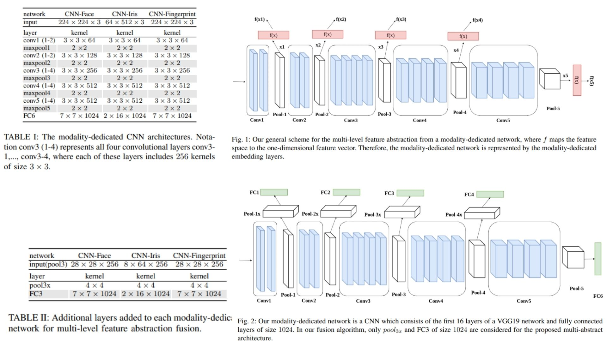
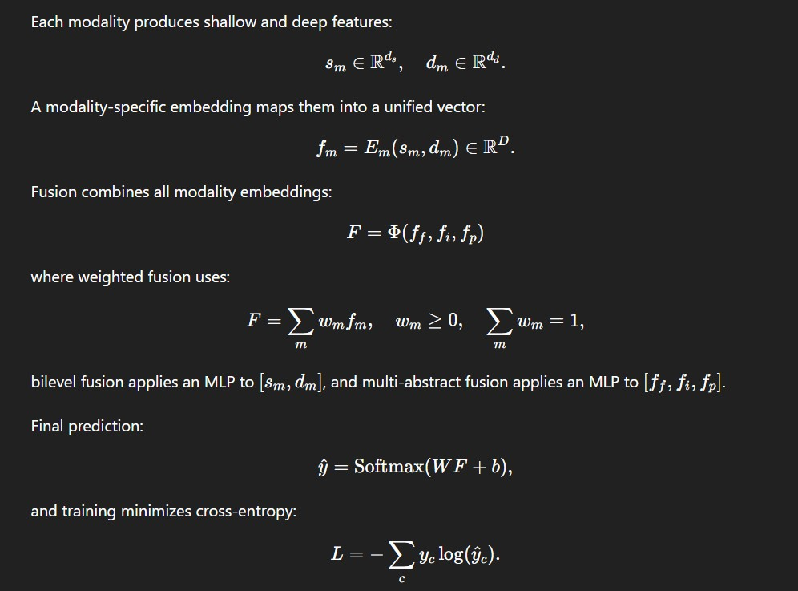

# 📃 Multimodal Biometric Fusion (PyTorch)

This repository contains a PyTorch implementation of a **multimodal biometric fusion model**, combining **face, iris, and fingerprint modalities**. Each modality produces **shallow and deep embeddings**, which are fused using **weighted, bilevel, or multi-abstract fusion** to improve recognition accuracy.

- Supports **VGG19-based backbones** per modality.  
- Extracts **pool3 (shallow)** and **FC6 (deep)** features for each modality.  
- Fusion strategies allow combining embeddings flexibly.  
- Classifier maps fused features to **target classes**.  

**Paper reference:** [Multimodal Biometric Fusion](https://arxiv.org/pdf/1807.01332)🐵

---

## 🖼 Overview – Fusion Pipeline

  

This overview illustrates the pipeline across key stages:

- **Input:** Face, iris, and fingerprint images.  
- **Backbones:** Each modality passes through a VGG19-based feature extractor.  
- **Embedding:** Shallow (pool3 → FC3) and deep (FC6) embeddings extracted per modality.  
- **Fusion:** Embeddings combined via **weighted**, **bilevel**, or **multi-abstract fusion**.  
- **Classifier:** Fused representation fed to a linear layer for final predictions.  

---

## 🧮 Key Mathematical Idea

  

- Each modality produces shallow $$s_m \in \mathbb{R}^{d_s}$$ and deep $$d_m \in \mathbb{R}^{d_d}$$ features.  
- Modality-specific embedding: $$f_m = E_m(s_m, d_m) \in \mathbb{R}^D$$  
- Fusion combines embeddings: $$F = \Phi(f_f, f_i, f_p)$$  
  - Weighted: $$F = \sum_m w_m f_m, \quad w_m \ge 0, \quad \sum_m w_m = 1$$  
  - Bilevel: MLP applied to $$[s_m, d_m]$$  
  - Multi-abstract: MLP applied to $$[f_f, f_i, f_p]$$  
- Final prediction: $$\hat{y} = \text{Softmax}(W F + b)$$  
- Training minimizes cross-entropy: $$L = - \sum_c y_c \log(\hat{y}_c)$$  

---

## 🏗️ Model Architecture

```bash
Multimodal-Biometric-Fusion/
│
├── src/
│   ├── layers/
│   │   ├── conv_block.py
│   │   ├── pooling.py
│   │   ├── flatten_fc.py
│   │   ├── embedding_layer.py
│   │   └── fusion_ops.py
│   │
│   ├── modality/
│   │   ├── modality_face.py
│   │   ├── modality_iris.py
│   │   ├── modality_fingerprint.py
│   │   └── modality_common.py
│   │
│   ├── modules/
│   │   ├── vgg_backbone.py
│   │   ├── multi_level_extractor.py
│   │   └── fusion_engine.py 
│   │
│   └── model/
│       └── multimodal_model.py
│   
│   
│
├── images/
│   ├── figmix.jpg
│   └── math.jpg
│
├── requirements.txt
└── README.md
```
---


## 🔗 Feedback

For questions or feedback, contact: [barkin.adiguzel@gmail.com](mailto:barkin.adiguzel@gmail.com)
